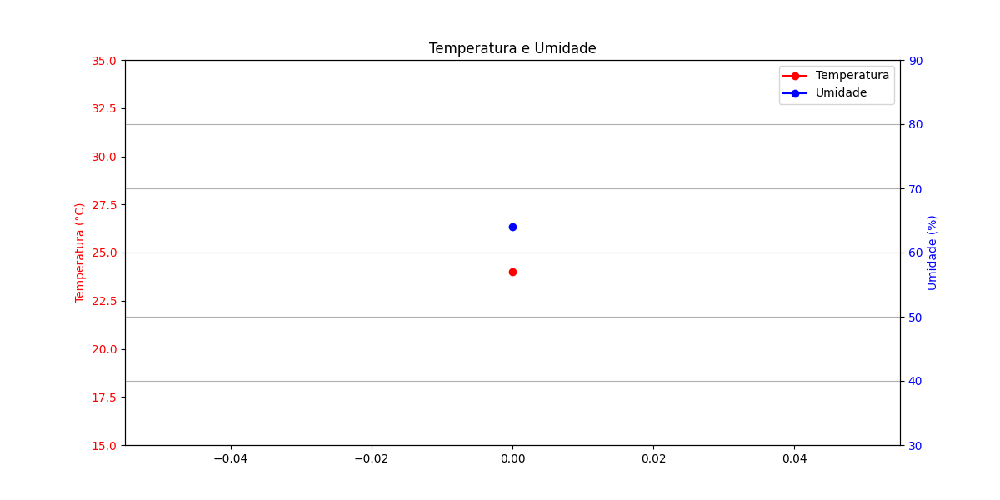
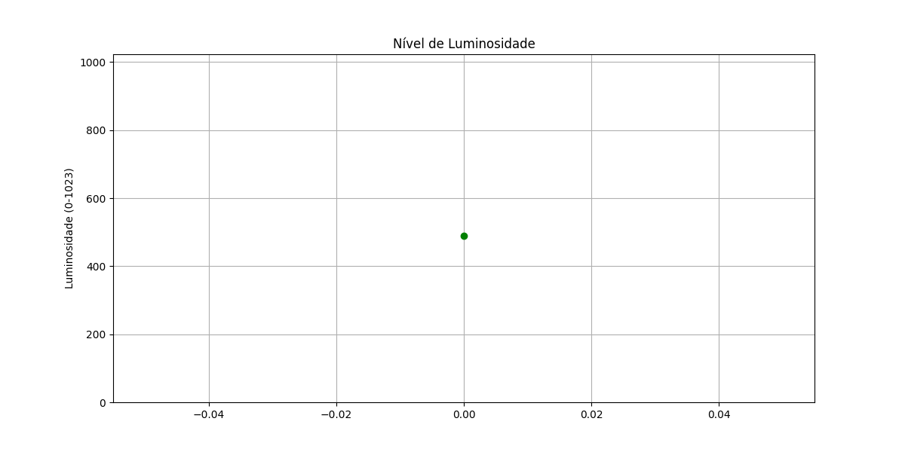
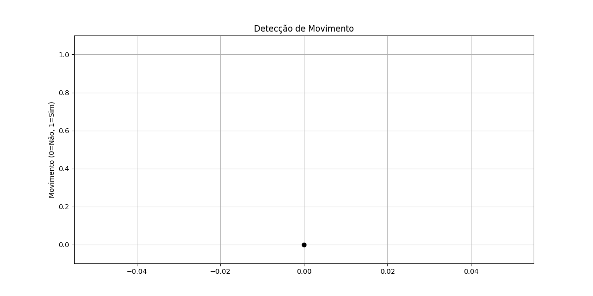
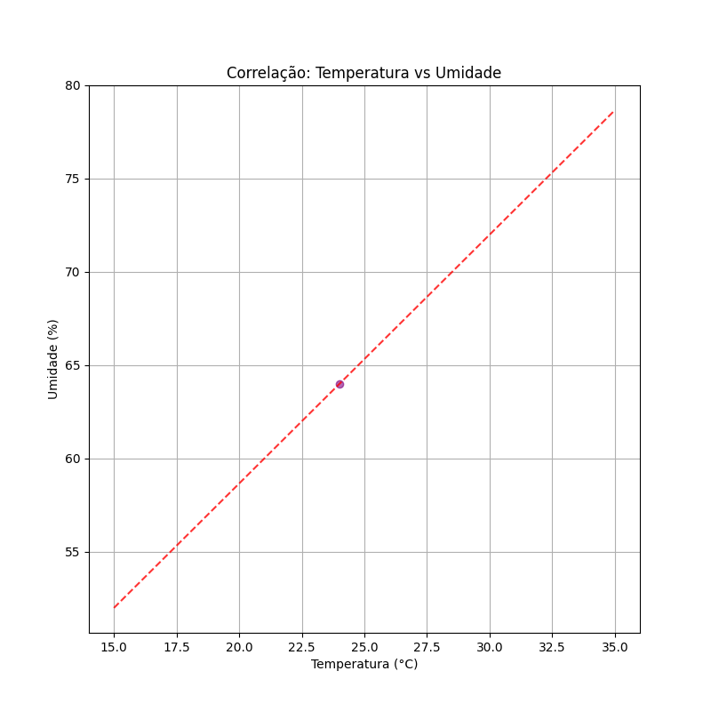

# Prints da Simulação

## 1. Console (Monitor Serial)

### Exemplo de Saída
```
=== Leituras dos Sensores ===
Timestamp: 2024-03-11 10:00:00
Temperatura: 25.5°C
Umidade: 62.3%
Luminosidade: 458 (0-1023)
Movimento: Detectado
```

### Explicação
- Os dados são exibidos em tempo real no console
- Cada leitura inclui timestamp e valores de todos os sensores
- Formato claro e organizado para fácil leitura
- Valores atualizados a cada 2 segundos

## 2. Arquivo JSON

### Exemplo de Dados
```json
{
  "timestamp": "2024-03-11 10:00:00",
  "sensores": {
    "dht22": {
      "temperatura": 25.5,
      "umidade": 62.3
    },
    "ldr": {
      "luminosidade": 458
    },
    "pir": {
      "movimento": 1
    }
  }
}
```

### Explicação
- Dados armazenados em formato JSON
- Estrutura hierárquica clara
- Fácil integração com outros sistemas
- Atualizado a cada leitura

## 3. Gráficos Gerados

### Temperatura e Umidade

- Gráfico combinado mostrando temperatura e umidade
- Eixos Y separados para cada medida
- Escalas apropriadas para cada variável
- Legenda clara

### Luminosidade

- Gráfico de linha mostrando nível de luminosidade
- Escala de 0 a 1023 (10 bits)
- Grade para fácil leitura
- Título e labels claros

### Movimento

- Gráfico de linha mostrando detecção de movimento
- Valores binários (0 ou 1)
- Escala ajustada para melhor visualização
- Grid para referência

### Correlação

- Gráfico de dispersão temperatura vs umidade
- Linha de tendência
- Grid para referência
- Labels claros nos eixos

## 4. Comportamento dos Sensores

### DHT22 (Temperatura e Umidade)
- Temperatura varia suavemente entre 20°C e 30°C
- Umidade varia entre 40% e 80%
- Valores realistas para ambiente interno
- Correlação negativa entre temperatura e umidade

### LDR (Luminosidade)
- Valores entre 0 (escuro) e 1023 (claro)
- Variações suaves
- Resposta não-linear à luz
- Valores típicos entre 400-600

### PIR (Movimento)
- Saída digital (0 ou 1)
- Detecções esporádicas
- Probabilidade de 10% por leitura
- Independente de outros sensores

## 5. Insights e Observações

### Padrões Observados
1. **Temperatura e Umidade**:
   - Variações suaves e realistas
   - Correlação negativa típica
   - Valores dentro de faixas seguras

2. **Luminosidade**:
   - Variações graduais
   - Valores concentrados na faixa média
   - Resposta não-linear

3. **Movimento**:
   - Detecções aleatórias
   - Distribuição uniforme
   - Independente de outros sensores

### Limitações da Simulação
1. Dados gerados sinteticamente
2. Sem ruído real do ambiente
3. Sem falhas de hardware
4. Sem interferências externas

### Possíveis Melhorias
1. Adicionar mais variabilidade
2. Implementar falhas simuladas
3. Adicionar ruído realista
4. Incluir mais sensores
5. Implementar dashboard web 